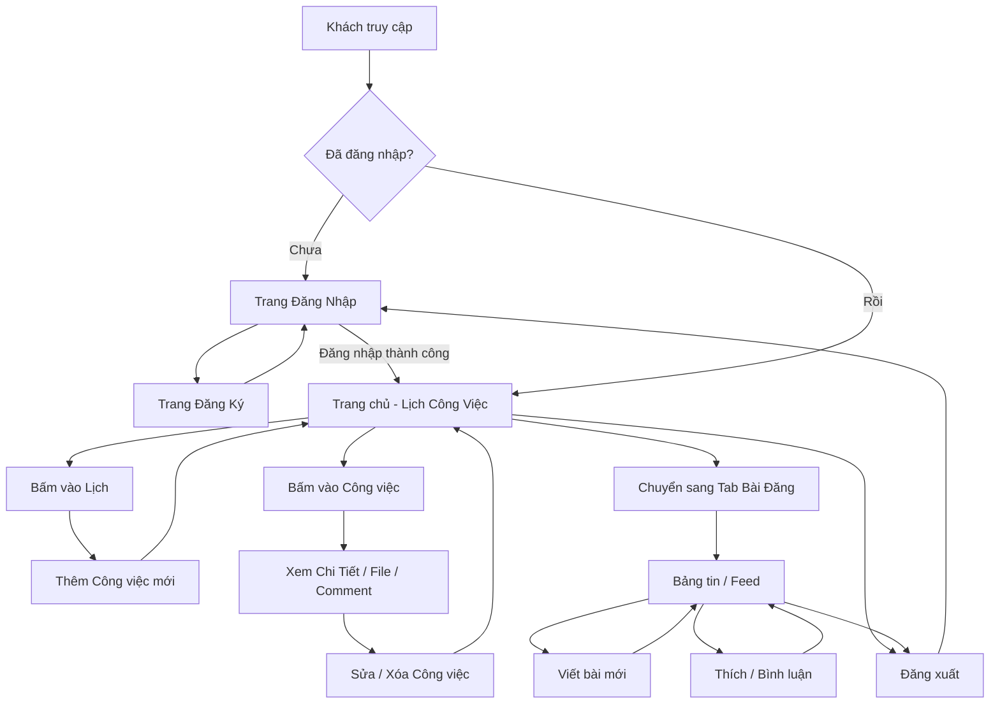

# 0. Luồng hoạt động của hệ thống (Workflow)

Tài liệu này mô tả cách ứng dụng hoạt động từ hai góc độ: **Hành trình của người dùng** (User Journey) và **Luồng kỹ thuật** (Technical Flow - MVC).

---

## Phần 1: Hành trình của người dùng (User Journey / User Flow)

Đây là các bước trải nghiệm thực tế của một người khi sử dụng web:

### Trạng thái 1: Khách vãng lai (Guest)
- Mở trình duyệt web và truy cập `http://localhost:3000/`.
- Hệ thống chặn lại vì chưa đăng nhập, tự động chuyển hướng đến trang **Đăng nhập**.
- Khách chưa có tài khoản $\rightarrow$ bấm nút **Đăng ký** $\rightarrow$ điền Tên đăng nhập & Mật khẩu $\rightarrow$ hệ thống báo thành công và chuyển về trang Đăng nhập.
- Khách nhập tài khoản vừa tạo $\rightarrow$ **Đăng nhập thành công**.

### Trạng thái 2: Người dùng hệ thống (User)
Sau khi đăng nhập, User chính thức bắt đầu trải nghiệm:

1. **Trang chủ (Quản lý Lịch & Công việc):**
   - User nhìn thấy một giao diện Lịch (FullCalendar) lớn giữa màn hình.
   - User bấm vào một ngày bất kỳ trên lịch $\rightarrow$ **Popup Thêm Công Việc** hiện lên.
   - User điền Tiêu đề, Giờ giấc, chọn Báo thức (Nhắc nhở), Đính kèm file $\rightarrow$ bấm **Lưu**.
   - Công việc lập tức xuất hiện thành một khối màu trên Lịch.

2. **Tương tác với Công việc:**
   - User bấm vào khối công việc trên lịch $\rightarrow$ **Popup Chi Tiết** hiện lên.
   - Tại đây, User có thể xem file đính kèm, viết **Bình luận**, hoặc bấm **Sửa / Xóa** nếu mình là chủ công việc đó.
   - Cứ mỗi 30 giây, trình duyệt ngầm kiểm tra. Nếu đến giờ báo thức, web sẽ phát tiếng "bíp" và hiện thông báo góc phải màn hình.

3. **Giao lưu Mạng xã hội (Bài đăng):**
   - Trên thanh menu (Navbar), User bấm chuyển sang tab **Bài đăng**.
   - Giao diện thay đổi thành dạng "Bảng tin" giống Facebook.
   - User viết trạng thái, chọn ảnh $\rightarrow$ bấm **Đăng**.
   - User cuộn xuống xem bài của người khác, bấm nút **Thích (Like)** hoặc viết **Bình luận**.

4. **Kết thúc:**
   - User bấm nút **Đăng xuất** trên thanh menu $\rightarrow$ quay trở lại trạng thái Khách.

---

## Phần 2: Luồng kỹ thuật chi tiết (Technical Flow - MVC)

Bảng dưới đây mô tả chi tiết quá trình xử lý ngầm (dưới góc độ Code) cho các hành động trên.

Tóm tắt kiến trúc vòng lặp:
**Client (Trình duyệt)** `gửi Request` $\rightarrow$ **Router** `định tuyến` $\rightarrow$ **Middleware** `kiểm tra đăng nhập` $\rightarrow$ **Controller** `xử lý logic` $\rightarrow$ **Model** `tương tác Database` $\rightarrow$ **View (EJS)** `render HTML` $\rightarrow$ **Client (Trình duyệt)** `hiển thị cho User`.

---

### 1. Luồng Xác thực & Phân quyền (Authentication Flow)

| Bước | Người dùng (Client) | URL / Route | Xử lý tại Controller | View trả về (Giao diện) |
|---|---|---|---|---|
| **1. Truy cập** | Gõ `http://localhost:3000/` | `GET /` | Kiểm tra middleware `requireAuth`. Chưa đăng nhập -> Đẩy (redirect) về trang Login | `users/login.ejs` |
| **2. Đăng ký** | Truy cập trang Đăng ký và điền form | `POST /users/register` | `userController.postRegister`: Kiểm tra trùng tên, Hash password (`bcrypt`), Lưu DB | Quay lại trang Login |
| **3. Đăng nhập** | Điền username + password | `POST /users/login` | `userController.postLogin`: Check DB, So sánh password, Lưu `userId` vào `req.session` | Đẩy về trang chủ (`/`) |
| **4. Đăng xuất** | Bấm nút "Đăng xuất" trên Navbar | `GET /users/logout` | `userController.logout`: Xóa session | Đẩy về trang Login |

---

### 2. Luồng Quản lý Công việc & Lịch (Task & Calendar Flow)

| Bước | Người dùng (Client) | URL / Route | Xử lý tại Controller | View trả về (Giao diện) |
|---|---|---|---|---|
| **1. Trang chủ** | Xem Lịch & Danh sách công việc | `GET /` | `taskController.getAllTasks`: Lấy task (của mình + được chia sẻ + công khai) | `tasks/index.ejs` (Hiển thị qua FullCalendar) |
| **2. Thêm Task** | Bấm vào 1 ngày trên lịch -> Điền Modal Form | `POST /new` | `taskController.createTask`: Upload file (Multer), lưu thông tin Task vào DB | Reload trang chủ (`/`) |
| **3. Sửa Task** | Bấm vào 1 Task -> Click "Sửa" | `GET /edit/:id` | `taskController.getEditTaskForm`: Lấy dữ liệu task cũ điền vào form | `tasks/edit.ejs` |
| **4. Lưu Sửa** | Sửa thông tin -> Bấm "Lưu" | `POST /edit/:id` | `taskController.updateTask`: Update DB, upload file mới (nếu có) | Reload trang chủ (`/`) |
| **5. Xóa Task** | Bấm vào 1 Task -> Click "Xóa" | `POST /delete/:id` | `taskController.deleteTask`: Kiểm tra đúng chủ sở hữu -> Xóa khỏi DB | Reload trang chủ (`/`) |

---

### 3. Luồng Tương tác Công việc (Interaction Flow)

| Bước | Người dùng (Client) | URL / Route | Xử lý tại Controller | View trả về / Kết quả |
|---|---|---|---|---|
| **1. Bình luận** | Gõ vào ô bình luận của 1 Task | `POST /comment/:id` | `taskController.addComment`: Thêm object comment vào mảng `comments` của Task đó | Reload trang chủ (`/`) |
| **2. Nhắc nhở** | Cứ mỗi 30s đang mở web | (Client-side JS) | Trình duyệt chạy JS (`setInterval`): Tính toán thời gian hiện tại vs thời gian Task | Phát tiếng bíp + Bật Popup Notification |
| **3. Xem File** | Bấm vào icon file trong Task | URL của file | Server trả về file tĩnh từ thư mục `public/uploads/` | Mở file / Tải file |

---

### 4. Luồng Bài đăng Mạng xã hội (Post Flow)

| Bước | Người dùng (Client) | URL / Route | Xử lý tại Controller | View trả về (Giao diện) |
|---|---|---|---|---|
| **1. Bảng tin** | Bấm tab "Bài đăng" trên Navbar | `GET /posts` | `postController.getAllPosts`: Lấy toàn bộ bài đăng, map với tên Tác giả | `posts/index.ejs` |
| **2. Viết bài** | Gõ nội dung + Chọn ảnh -> Đăng | `POST /posts/new` | `postController.createPost`: Lưu nội dung, Upload ảnh (Multer) | Reload trang `/posts` |
| **3. Thích bài** | Bấm nút "Thích" | `POST /posts/like/:id` | `postController.toggleLike`: Thêm/Xóa `userId` vào mảng `likes` | Reload trang `/posts` |
| **4. Bình luận** | Viết comment vào bài đăng | `POST /posts/comment/:id` | `postController.addComment`: Push comment vào mảng | Reload trang `/posts` |
